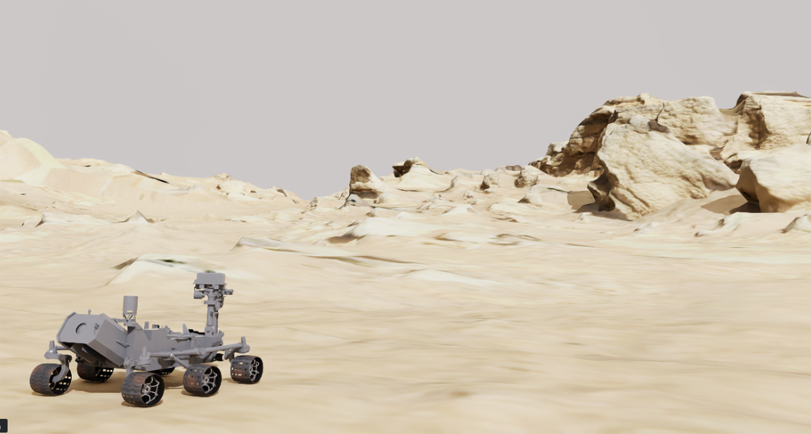
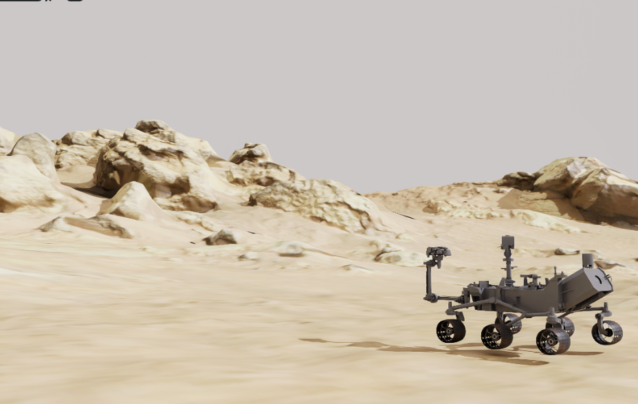

# Space ROS Simulation - IsaacSim Extension

This repository contains simulation assets and modules for Space ROS demos using Nvidia’s IsaacSim. It extends IsaacSim with specialized features for simulating space robotics.

## Workstation Installation

Refer [link](https://docs.omniverse.nvidia.com/isaacsim/latest/installation/install_workstation.html) for  workstation installation of Isaac Sim.

<p align="center">
  
</p>

## System Requirements

Ensure your system meets the minimum specifications to run this project:

| Element  | Minimum Spec                          | Good Spec                               | Ideal Spec                                        |
|--------- |---------------------------------------|-----------------------------------------|---------------------------------------------------|
| **OS**   | Ubuntu 20.04/22.04, Windows 10/11     | Ubuntu 20.04/22.04, Windows 10/11       | Ubuntu 20.04/22.04, Windows 10/11                 |
| **CPU**  | Intel Core i7 (7th Gen), AMD Ryzen 5  | Intel Core i7 (9th Gen), AMD Ryzen 7    | Intel Core i9, X-series or higher, AMD Ryzen 9, Threadripper or higher |
| **Cores**| 4                                     | 8                                       | 16                                                |
| **RAM**  | 32GB*                                 | 64GB*                                   | 64GB*                                             |
| **Storage**| 50GB SSD                             | 500GB SSD                               | 1TB NVMe SSD                                      |
| **GPU**  | GeForce RTX 3070                      | GeForce RTX 4080                        | RTX Ada 6000                                      |
| **VRAM** | 8GB*                                  | 16GB*                                   | 48GB*                                             |


## Prerequisites

This project is built upon Nvidia IsaacSim, and tested with Ubuntu 22.04. You’ll need the following dependencies:

| Dependency | Version  | Description                                                                                                                                                                         |
| ---------- | -------- | ----------------------------------------------------------------------------------------------------------------------------------------------------------------------------------- |
| IsaacSim   | >=4.0.0 or Cloud | Check System Compatibility with [software](https://docs.omniverse.nvidia.com/isaacsim/latest/installation/requirements.html#isaac-sim-compatibility-checker)   
| | | Setup Cloud Based Nvidia Isaac Sim [follow](https://docs.omniverse.nvidia.com/isaacsim/latest/installation/install_cloud.html)|                                            |
| ROS2       | Humble   | ROS2 Humble acts as a middleware. Installation details [here](https://docs.ros.org/en/humble/Installation.html).                                                                     |

## Getting Started

Follow these steps to get started:

1. **Install Prerequisites**: Ensure all dependencies are installed as per the instructions in the prerequisites section. In addition add `git-lfs` to enable large size files. To install run the command 'sudo apt-get install git-lfs && git lfs install'
2. **Clone the Repository**:
   ```bash
    git clone https://github.com/space-ros/simulation.git
    cd <path-to-simulation-directory>
    git lfs pull
    ```
3. The Isaac Extension contains following structure:
   - documents : Detailed documents and its relevant images
   - isaac_assets : Contains all the required assets for the simulation. Included apollo16, mars terrain environments.
   - models :  Contains the robot models
4. Open Isaac Simulation using the [Isaac Sim App Selector](https://docs.omniverse.nvidia.com/isaacsim/latest/installation/install_workstation.html#isaac-sim-short-app-selector)
   > NOTE: 
        1. Make sure ROS2 Bridge is extension is enabled in the IsaacSim. You can enable it by the previous steps mentioned for the extensions.
        2. Refer this to enable/disable the [ROS2 extension](https://docs.omniverse.nvidia.com/isaacsim/latest/installation/install_ros.html#enabling-the-ros-bridge-extension)
5. Go to your local workspace inside isaac simulation
6. Copy the simulation folder `<path-to-simulation-directory>` inside the issac environment to enable all the assets along with the world
7. Open the `NasaRoverChallenge.usd` for the enviroment and rover robot. The environment should open with following visuals.
<p align="center">
  
</p>

8. Now, the simulation is ready.
9. To move further refer below mentioned documents 
    1.  [URDF Import](https://docs.omniverse.nvidia.com/isaacsim/latest/ros2_tutorials/tutorial_ros2_turtlebot.html)
    2.  [Rover Action Graph](documents/docs/action_graph.md) 
    