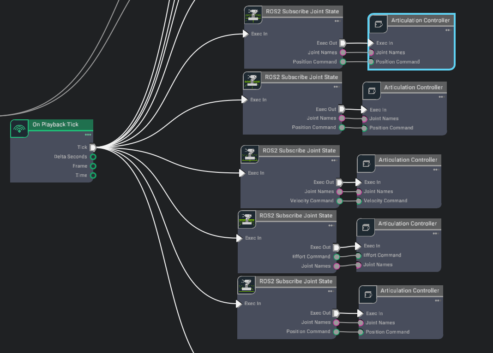
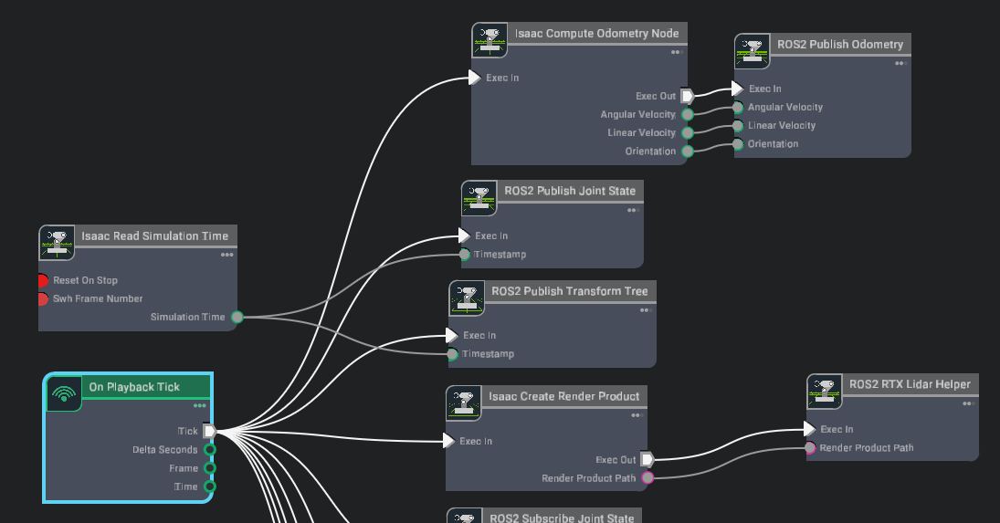
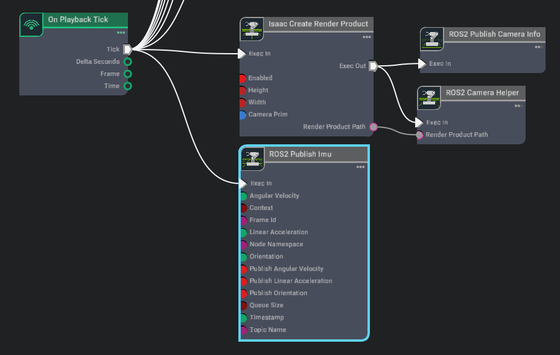

# Nvidia Isaac Action Graphs

The Action Graph serves as a visual programming framework, enabling users to design complex robotic behaviors by linking various functional nodes. These nodes act as building blocks representing specific capabilities that, when connected, create a data flow. The tool allows users to craft intricate robotic behaviors without the need for manual coding. The Action Graph’s intuitive interface makes it possible to easily build custom behaviors for robots in a simulated environment. 

Refer below action graph details:
1.  ROS2 Joint State Messages Subcriber for Wheels (movement + steer), Arm, Mast
2.  ROS2 Joint State Publisher
3.  ROS2 Transform Tree Publisher
4.  ROS2 Camera Data and Information Publisher
5.  ROS2 2D RTX Lidar Publisher
6.  ROS2 IMU Publisher
7.  ROS2 Odometry Publisher

### ROS2 Joint State Messages Subcriber for Wheels (movement + steer), Arm, Mast

The Action Graph for Subscribing to Joint State Messages is used to subscribe to joint state messages from the ROS2 network. The action graph reads joint state messages from the ROS2 network and provides the joint state data to the simulation environment. The action graph provides a node that subscribes to joint state messages from the ROS2 network and provides the joint state data to the simulation environment. The action graph can be used to subscribe to joint state messages from the ROS2 network and update the joint states of the robot in the simulation environment.
This grpah controls all the joint movement commands (wheel movement, steer movement, mast joint trajectories and arm joint trajectories).
> Note: Make sure the ros2 topic names are correct

  

### ROS2 Joint State Publisher 
The Action Graph for Publishing Joint State Messages enables the simulation to send joint state data to the ROS2 network. This graph includes a node that collects joint state information from the simulation environment and publishes it to the ROS2 network. By using this action graph, you can ensure that the current joint positions and movements of the robot in the simulation are continuously communicated to ROS2, allowing for real-time synchronization and further processing within the ROS2 ecosystem.

  

### ROS2 Transform Tree Publisher 
The Action Graph for Publishing the Transform Tree allows the simulation to broadcast the robot's full transform tree to the ROS2 network. This graph contains a node that gathers the transform data (position and orientation) of all relevant links in the robot and publishes it to the ROS2 network. By using this action graph, the simulation can ensure that the robot's pose and orientation are continuously updated in ROS2, allowing for accurate tracking and coordination of the robot's frames in real-time.
 > Note: Refer above image for connections

### ROS2 Camera Data and Information Publisher
The Action Graph for Publishing Camera Data enables the simulation to stream camera feed to the ROS2 network. This graph includes a node that captures image data from the simulation's camera sensors and publishes it to the ROS2 network. With this setup, the camera's visual data, such as RGB images or depth information, can be continuously transmitted for processing in ROS2, enabling real-time vision-based tasks like object detection or navigation within the robotic system.

> Note: Refer [LINK](https://docs.omniverse.nvidia.com/isaacsim/latest/ros2_tutorials/tutorial_ros2_camera.html) fpr detailed camera integration

  

### ROS2 2D RTX Lidar Publisher
The Action Graph for Publishing LiDAR Data allows the simulation to send LiDAR sensor data, generated using RTX ray tracing, to the ROS2 network. This graph contains a node that captures high-fidelity point cloud data from the LiDAR sensor in the simulation and publishes it to the ROS2 network. Leveraging RTX ray tracing for accurate environmental scanning, this setup ensures that detailed, real-time LiDAR data is transmitted, supporting tasks like mapping, obstacle detection, and navigation in the ROS2-based robotic system.
> NOTE: Refer ROS2 RTX Lidar Helper block. For detailed analysis and in depth tuning refer [LINK](https://docs.omniverse.nvidia.com/isaacsim/latest/ros2_tutorials/tutorial_ros2_rtx_lidar.html)

  

### ROS2 Publisher for IMU Data
The Action Graph for Publishing IMU Data enables the simulation to transmit IMU sensor data to the ROS2 network. This graph includes a node that reads data such as acceleration, angular velocity, and orientation from the IMU sensor within the simulation and publishes it to ROS2. By utilizing this setup, the real-time motion and orientation data of the robot is continuously shared with ROS2, making it ideal for tasks like state estimation, motion tracking, and navigation in ROS2-based applications.

  

> Note: 
> 1. The node 'Isaac Read IMU Node' expects the prim path of the IMU sensor to provide the IMU data. If rover is used, the IMU sensor is expected to be attached to the main body of the rover.
> 2. If you are using the rover in different gravity conditions, make sure the `readGravity` parameter of Node 'Isaac Read IMU Node' is set to true. This will read the gravity vector from the simulation environment and apply it to the IMU data.

### ROS2 Odometry Publisher
The Action Graph for Publishing Odometry Data allows the simulation to send odometry information to the ROS2 network. This graph includes a node that captures the robot's position and velocity data, such as linear and angular movement, from the simulation environment and publishes it to ROS2. With this setup, real-time odometry data is continuously streamed, supporting tasks like robot localization, path planning, and navigation in ROS2-based systems.

> Note: Refer Compute Odometry and Publish odometry Block. For details refer [LINK](https://docs.omniverse.nvidia.com/isaacsim/latest/ros2_tutorials/tutorial_ros2_tf.html)

  

