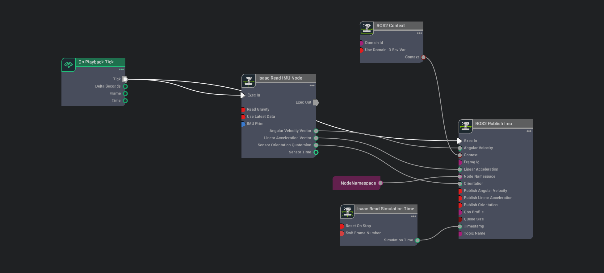
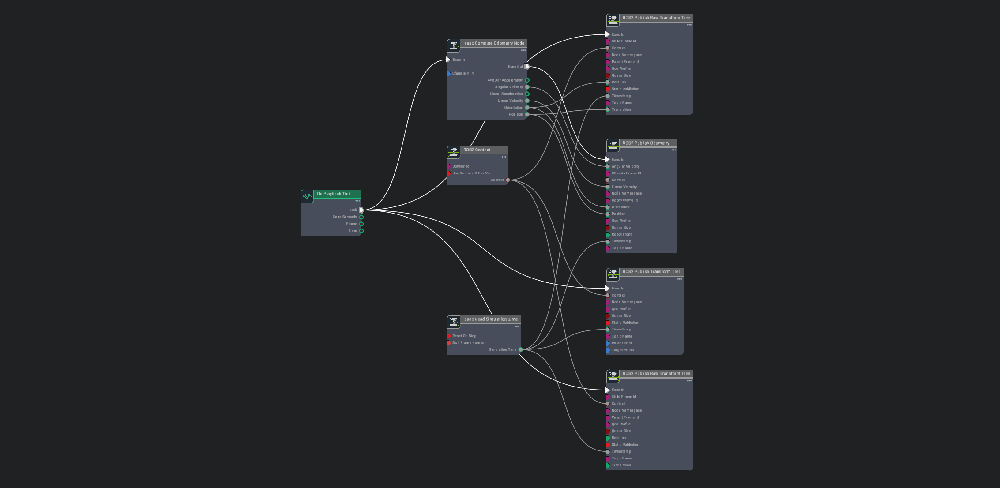
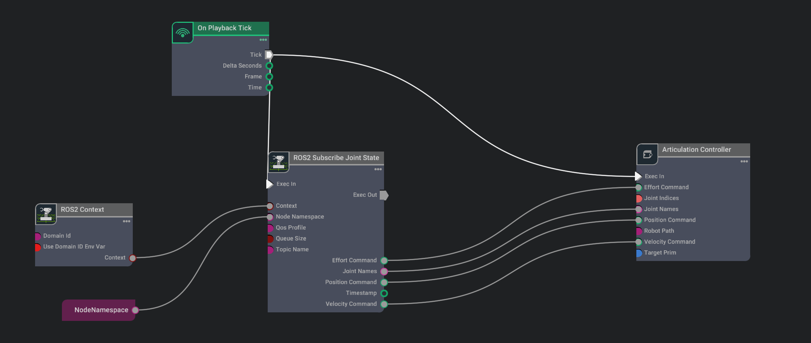

## Action Graphs

The Action Graph is a visual programming tool that allows users to create complex robotic behaviors by connecting nodes. The nodes in the Action Graph represent different functionalities that can be used to create a robotic behavior. The nodes can be connected to create a flow of data between them. The Action Graph provides a user-friendly interface to create complex robotic behaviors without writing any code. The Action Graph is a powerful tool that can be used to create custom behaviors for robots in the simulation environment.

This article provides an overview of commonly used action graphs in Space ROS. The article covers the following topics:

- [Action Graphs](#action-graphs)
  - [ROS2 Publisher for IMU Data](#ros2-publisher-for-imu-data)
  - [ROS2 Publisher for Odom Data](#ros2-publisher-for-odom-data)
  - [ROS2 Publisher for Camera Data](#ros2-publisher-for-camera-data)
  - [Action Graph for Subscribing to Joint State Messages](#action-graph-for-subscribing-to-joint-state-messages)
  - [ROS2 Suscriber for Twist Messages](#ros2-suscriber-for-twist-messages)

### ROS2 Publisher for IMU Data

The ROS2 Publisher for IMU Data action graph is used to publish IMU data to the ROS2 network. The action graph reads IMU data from the simulation environment and publishes it to the ROS2 network. The action graph provides a node that reads IMU data from the simulation environment and publishes it to the ROS2 network. The action graph can be used to publish IMU data to the ROS2 network for further processing.

  

> #### Note
>  - The node 'Isaac Read IMU Node' expects the prim path of the IMU sensor to provide the IMU data. If rover is used, the IMU sensor is expected to be attached to the main body of the rover.
> - If you are using the rover in different gravity conditions, make sure the `readGravity` parameter of Node 'Isaac Read IMU Node' is set to true. This will read the gravity vector from the simulation environment and apply it to the IMU data.

### ROS2 Publisher for Odom Data

The ROS2 Publisher for Odom Data action graph is used to publish odometry data to the ROS2 network. The action graph reads odometry data from the simulation environment and publishes it to the ROS2 network. The action graph provides a node that reads odometry data from the simulation environment and publishes it to the ROS2 network. The action graph can be used to publish odometry data to the ROS2 network for further processing.

  

> #### Note
> - The node 'Isaac Compute Odom Node' expects the target prim path of the rover to provide the odometry data. Make sure the prim path of the rover mesh body is provided to the 'Isaac Compute Odom Node'.

### ROS2 Publisher for Camera Data

The ROS2 Publisher for Camera Data action graph is used to publish camera data to the ROS2 network. The action graph reads camera data from the simulation environment and publishes it to the ROS2 network. The action graph provides a node that reads camera data from the simulation environment and publishes it to the ROS2 network. The action graph can be used to publish camera data to the ROS2 network for further processing.

  

> #### Note
> - The node 'Isaac Create Render Product' expects the camera prim path to provide the camera data. Make sure the prim path of the camera is provided to the 'Isaac Read Camera Node'.
> - IsaacSim comes with different types of image data which can be selected from the 'Type' parameter of the 'ROS2 Camera Helper'. Make sure the correct image type is selected to get the desired camera data. The above graph show the configuration for RGB image data and the camera info data.

### Action Graph for Subscribing to Joint State Messages

The Action Graph for Subscribing to Joint State Messages is used to subscribe to joint state messages from the ROS2 network. The action graph reads joint state messages from the ROS2 network and provides the joint state data to the simulation environment. The action graph provides a node that subscribes to joint state messages from the ROS2 network and provides the joint state data to the simulation environment. The action graph can be used to subscribe to joint state messages from the ROS2 network and update the joint states of the robot in the simulation environment.

  

> #### Note
> - The node 'ROS2 Subscribe Joint State' should receive the name of the joints that need to be updated in the simulation environment. Make sure the correct joint names are provided to the 'ROS2 Subscribe Joint State' node.
> - The joint state action graph can be duplicated to multiple graphs for better organization of the joint state messages. The joint state action graph can be used to subscribe to joint state messages from the ROS2 network and update the joint states of the robot in the simulation environment.

### ROS2 Suscriber for Twist Messages

The ROS2 Subscriber for Twist Messages action graph is used to subscribe to twist messages from the ROS2 network. The action graph reads twist messages from the ROS2 network and provides the twist data to the simulation environment. The action graph provides a node that subscribes to twist messages from the ROS2 network and provides the twist data to the simulation environment. The action graph can be used to subscribe to twist messages from the ROS2 network and update the twist data of the robot in the simulation environment.

  

The above action graph is used to subscribe to twist messages from the ROS2 network and update the twist data of the rover in the simulation environment.

> #### Note
> - The node 'ROS2 Subscribe Twist' should receive the name of the twist topic that needs to be subscribed. Make sure the correct twist topic name is provided to the 'ROS2 Subscribe Twist' node.
> - The twist action graph can be duplicated to multiple graphs for better organization of the twist messages. The twist action graph can be used to subscribe to twist messages from the ROS2 network and update the twist data of the robot in the simulation environment.