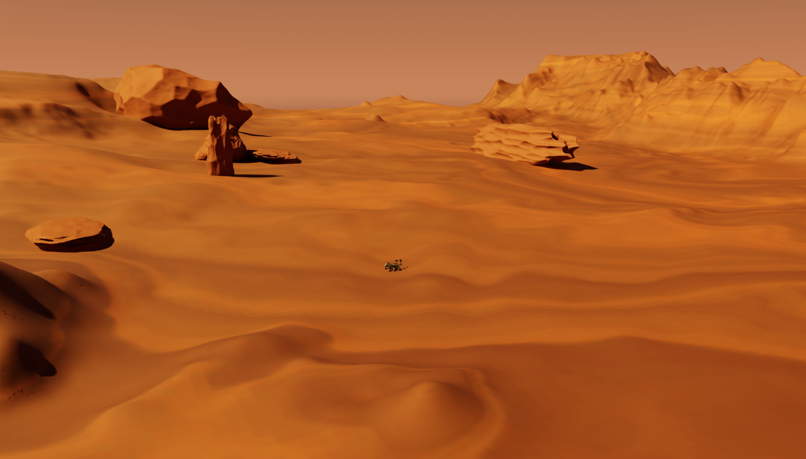

# Space ROS Environments

At the moment, we only provide the support for environments focusing on International Space Station (ISS), Mars surface ans Lunar surface.

You can find the assets in the directory `./assets/Environments`. These environments are simulation ready and can be used in the IsaacSim.

## List of Environments

| Environment  | Description                                                                 | Preview                                                                          |
| ------------ | --------------------------------------------------------------------------- | -------------------------------------------------------------------------------- |
| ISS          | International Space Station                                                 |                       |
| ISS Interior | International Space Station Interior for Astrobee and Robonaut2             |  |
| Mars         | Mars Surface of size 800 sq.m for extraction and exploration related tasks  |                 |
| Moon         | Lunar Surface of size 800 sq.m for extraction and exploration related tasks |                                 |
| Robotnaut2   | Robotnaut2 in Manipulation Room                                             |          |
| Ingenuity Rover Simple Scene | Simple scene with Ingenuity Helicopter for Visual Odometry and Navigation |  |

## Usage

You can use the environments in your simulation by importing the assets in the IsaacSim. The assets are provided in the `./assets/Environments` directory.

You will need to create scenes in the IsaacSim and import the assets in the scene. The scenes can be created using either IsaacSim's Omniverse Kit or Omniverse Create. More information on creating scenes can be found in the [documentation](./scenes.md).
