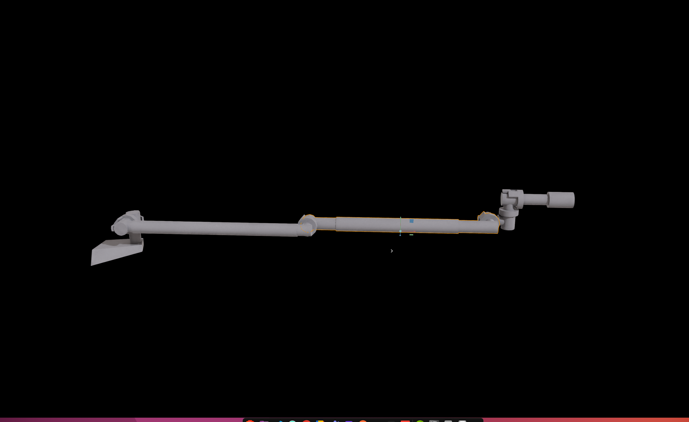
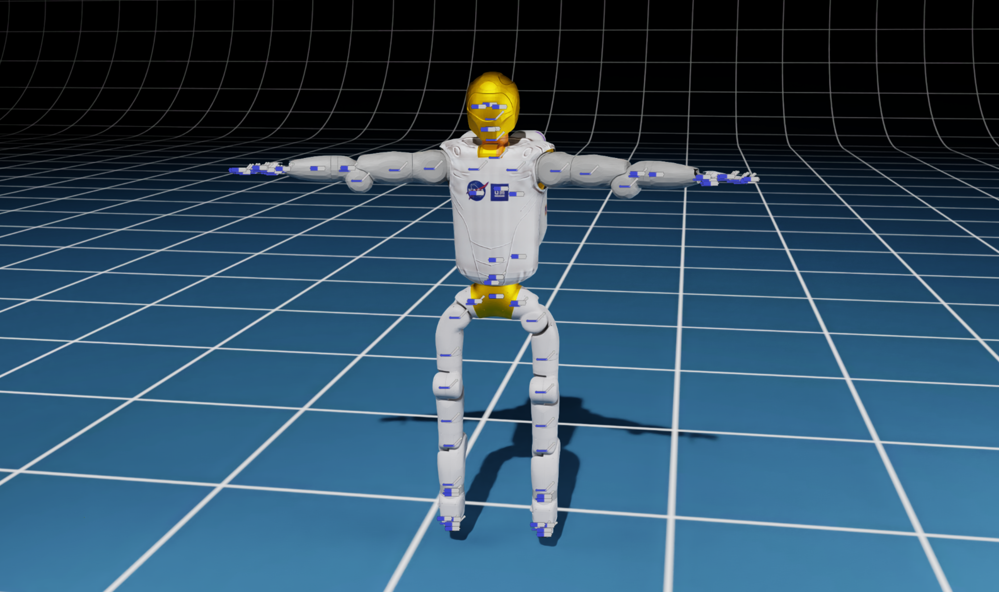
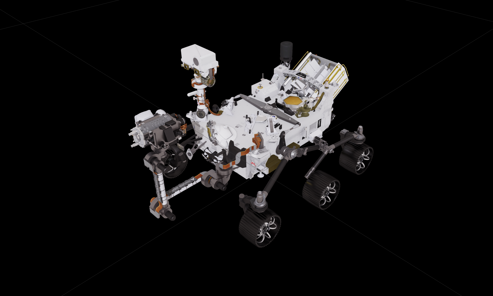

# Robot Assets

The robot assets are the models of the robots that can be used in the IsaacSim simulation environment. The robot assets are available in the `./assets/Robots` directory.

## List of Robots

| Robot Name                                                | Description                                                                                                                                                     | Preview                                                                       |
| --------------------------------------------------------- | --------------------------------------------------------------------------------------------------------------------------------------------------------------- | ----------------------------------------------------------------------------- |
| [Canadarm2](../robots/canadarm2.md)                       | Canadarm2 is a robotic arm used on the International Space Station (ISS) for various tasks like capturing and docking spacecraft, moving equipment, etc.        |                                |
| Canadarm2 17DoFs                                          | Canadarm2 with 17 Degrees of Freedom (DoFs)                                                                                                                     |                   |
| Canadarm1                                                 | Canadarm1 is a robotic arm used for manipulation tasks in space. It is designed for tasks like capturing and docking spacecraft, moving equipment, etc.         |  |
| [Robotnaut2](../robots/robonaut2.md)                      | Robotnaut2 is a humanoid robot designed for space exploration. It is equipped with a manipulator arm and a camera for performing tasks in space.                |                                |
| [Robonaut2 Upper Body](../robots/robonaut2.md)            | Robonaut2 Upper Body is the upper part of the Robonaut2 humanoid robot. It is equipped with a manipulator arm and a camera for performing tasks in space.       |            |
| [Curiosity Rover](../robots/curiosity.md)                 | Curiosity Rover is a Mars rover designed for exploration tasks on the Mars surface. It is equipped with a manipulator arm and a camera for performing tasks.    |                    |
| Perseverance Rover                                        | Perseverance Rover is a Mars rover designed for exploration tasks on the Mars surface. It is equipped with a manipulator arm and a camera for performing tasks. |              |
| [Ingenuity Helicopter](../robots/ingenuity-helicopter.md) | Ingenuity Helicopter is a Mars helicopter designed for aerial exploration tasks on the Mars surface. It is equipped with a camera for performing tasks.         |          |
