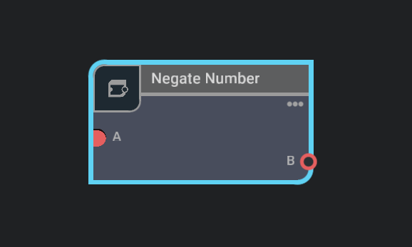
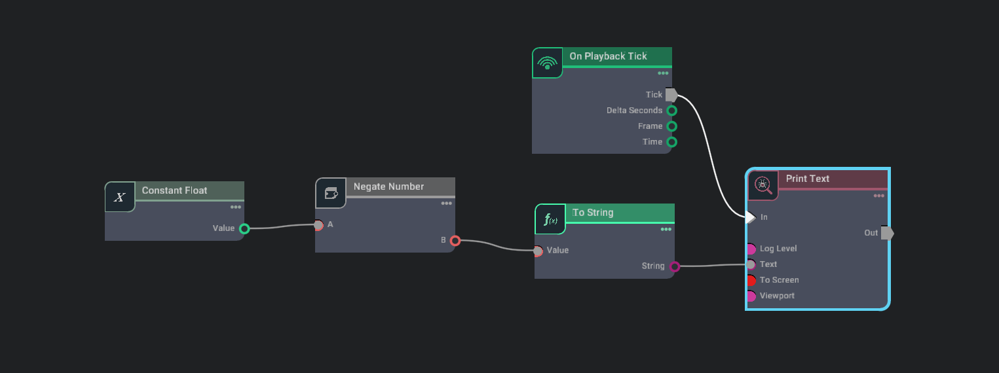

## Negate Number - Omnigraph Node Extension Example

The Negate Number extension is an omnigraph node extension that adds a node to negate the input number. This extension allows negating the input number and provides the negated number as the output.

This is an example extension to demonstrate how to create an omnigraph node extension in Space ROS.

### Node Configuration

The Negate Number extension can be enabled from Extension Manager of Space ROS. The node can be added to the action graph by searching "Negate Number" in the Node Search Panel of Action Graph. The node provides the following configuration options:

  

| Node Connection | Description                    |
| --------------- | ------------------------------ |
| A               | The input number to be negated |
| B               | The negated output number      |

## Sample Usage

  

The above example shows how to use the Negate Number extension in the omnigraph node. The extension provides a node that negates the input number and provides the negated number as the output. The extension allows negating the input number and provides the negated number as the output.