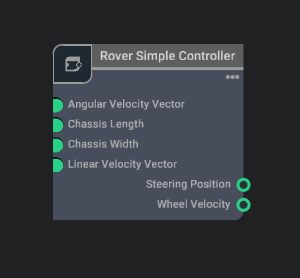
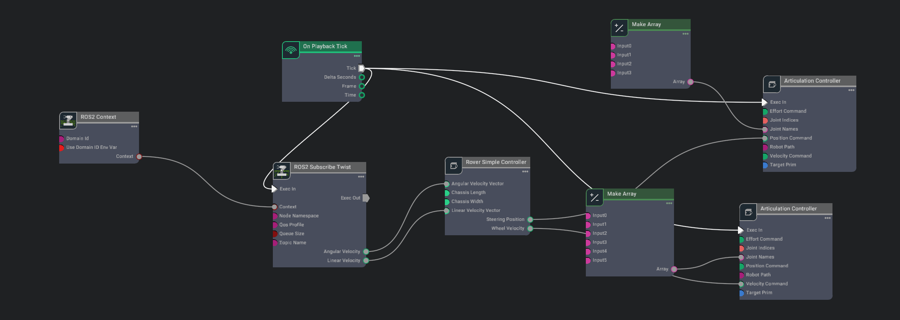

## Rover Simple Controller - Omnigraph Node Extension

The Rover Simple Controller extension is an omnigraph node extension that adds a simple controller for the rover in the simulation environment. This extension allows controlling mobile platforms using teleoperation. The extension provides a simple controller that can be used to control the rover in the simulation environment using the keyboard.

### Node Configuration

The Rover Simple Controller extension can be enabled from Extension Manager of Isaac Sim. The node can be added to the action graph by searching "Rover Simple Controller" in the Node Search Panel of Action Graph. The node provides the following configuration options:

  

| Node Connection          | Description                                                                        |
| ------------------------ | ---------------------------------------------------------------------------------- |
| Chassis Length           | The length of the chassis of the rover in meters                                   |
| Chassis Width            | The width of the chassis of the rover in meters                                    |
| Angular Velocity Vectory | The angular velocity vector of the rover in radians per second [format: (x, y, z)] |
| Linear Velocity Vector   | The linear velocity vector of the rover in meters per second [format: (x, y, z)]   |
| Steering Position        | The steering position of the rover in radians                                      |
| Wheel Velocity           | The wheel velocity of the rover in meters per second. Size of (6*1)                |

## Sample Usage

  

The above example shows how to use the Rover Simple Controller extension in the omnigraph node. The extension provides a simple controller that can be used to control the rover in the simulation environment using the keyboard. The extension allows controlling mobile platforms using teleoperation.